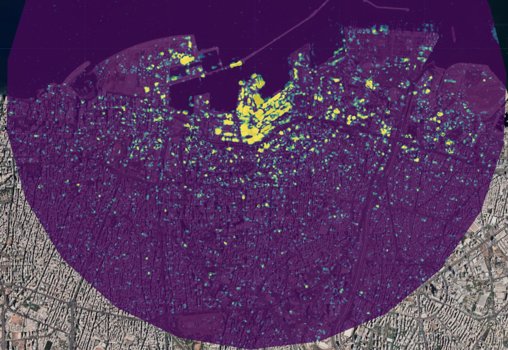

## Project Summary 

Our project enables a wide range of users to analyse the walkability of London’s streets and explore specific routes. Rather than imposing a single definition, the application allows users to apply their own walkability criteria.

To support this, we break walkability down into a set of pre-computed parameters for each street segment. Users can then assign their own weights to these parameters based on what matters most to them. These user-defined weights are incorporated into a modified cost function within Dijkstra’s algorithm, enabling the system to compute the most suitable route according to each individual’s preferences.

### Problem Statement

Existing studies have explored walkability and route attractiveness, with tools like the [Healthy Streets Index](https://www.healthystreets.com/maps/london) presenting results through colour-graded maps. However, these approaches rely on fixed indicator weights, limiting their ability to reflect individual user preferences and personal definitions of walkability.

### End User 

Who are you building this application for? How does it address a need this community has?

### Data

What data are you using? 

### Methodology

How are you using this data to address the problem?

### Interface

How does your application's interface work to address the needs of your end user?

## The Application 

Replace the link below with the link to your application.

:::{.column-page}

<iframe src='https://ollielballinger.users.earthengine.app/view/turkey-earthquake' width='100%' height='700px'></iframe>

:::

## How it Works 

Use this section to explain how your application works using code blocks and text explanations (no more than 500 words excluding code):

```js
Map.setCenter(35.51898, 33.90153, 15);

Map.setOptions("satellite");

var aoi = ee.Geometry.Point(35.51898, 33.90153).buffer(3000);
```

You can include images:



and math:
$$ \Large t = {\frac{\overline{x_1}-\overline{x_2}} {\sqrt{\frac{s^2_1}{n_1} + \frac{s^2_2}{n_2}}}} $$


