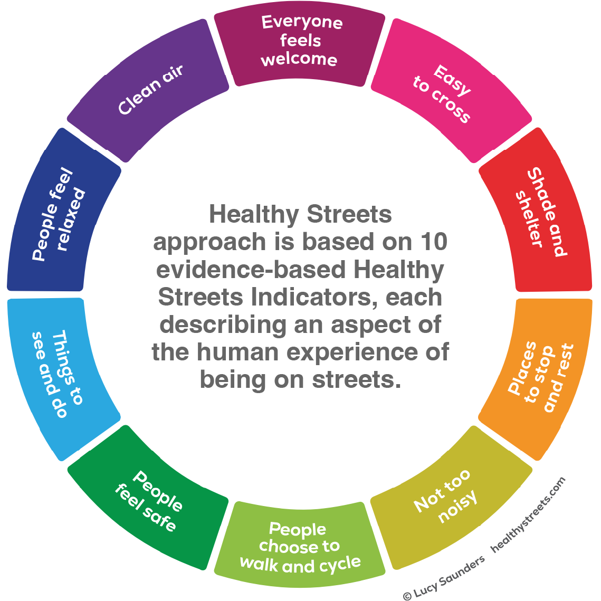

## Project Summary 

Our project enables a wide range of users to analyse the walkability of London’s streets and explore specific routes. Rather than imposing a single definition, the application allows users to apply their own walkability criteria.

To support this, we break walkability down into a set of pre-computed parameters for each street segment. Users can then assign their own weights to these parameters based on what matters most to them. These user-defined weights are incorporated into a modified cost function within Dijkstra’s algorithm, enabling the system to compute the most suitable route according to each individual’s preferences.

### Problem Statement

Existing studies have explored walkability and route attractiveness, with tools like the [Healthy Streets Index](https://www.healthystreets.com/maps/london) presenting results through graduated colour maps.
However, these approaches rely on fixed indicator weights, limiting their ability to reflect individual user preferences and personal definitions of walkability.

### End User

We identified two main end user groups:

* **Policy makers and built environment professionals** require not only robust, evidence-based data to inform policies and interventions, but also the ability to adjust how walkability is defined, for example, in response to outputs from community engagement.

* **The wider public** require tools that help identify optimal walking routes. The application’s origin-destination module serves as a proof of concept, demonstrating how diverse walkability criteria can be integrated into everyday route planning tools.

### Data

We  organised the data by walkability criteria that were used in calculations. For comparability, the criteria are matching those of [Healthy Streets Index](https://www.healthystreets.com/maps/london).

{{< accordion items='[
{"header":"Everyone feels welcome","body":"Everyone feels welcome","collapsed":true},
{"header":"Shade and shelter","body":"Shade and shelter","collapsed":true},
{"header":"Places to stop and rest","body":"Places to stop and rest","collapsed":true},
{"header":"Not too noisy","body":"**Road noise exposure** as a proxy for acoustic comfort © Crown copyright, Open Government Licence v3.0. [Source]()","collapsed":true},
{"header":"People choose to walk and cycle","body":"People choose to walk and cycle","collapsed":true},
{"header":"People feel safe","body":"**Safety from crime** represented with reported crime counts. Sourced using the Police API. Street-level crimes in the past year (2025) were added. UK Home Office via data.police.uk, OGL v3.0. [Source](https://data.police.uk/docs/) <br> **Safety from traffic** represented with counts of pedestrian collisions occurred 2023-26 (all injury levels). Several years ensure sufficient density of points. © TfL [Source](https://experience.arcgis.com/experience/f817ed4d14b7434584959384d560f1fc/page/Page)","collapsed":true},
{"header":"Things to see and do","body":"**Street activity** represented by points of interest such as shops and services. The data for this research have been provided by the Geographic Data Service (GeoDS), a Smart Data Research UK Investment: ES/Z504464/1. [Source](https://data.geods.ac.uk/dataset/point-of-interest-data-for-the-united-kingdom) <br> **Richness of historic environment** represented with listed buildings as points. © Crown Copyright 2026. Contains Ordnance Survey data © Crown copyright and database right 2026. Released under OGL. [Source](https://opendata-historicengland.hub.arcgis.com/datasets/historicengland::listed-building-points/explore)","collapsed":true},
{"header":"People feel relaxed","body":"**Green space exposure**, represented with vegetation cover (NDVI) derived from Sentinel-2 COPERNICUS/S2_SR_HARMONIZED GEE layer. Contains modified Copernicus Sentinel data (2023), processed via Google Earth Engine. [Source](https://developers.google.com/earth-engine/datasets/catalog/COPERNICUS_S2_SR_HARMONIZED)","collapsed":true},
{"header":"Clean air","body":"**Atmospheric emissions**, representing street-level air pollution – NO2, PM2.5, PM10. Greater London Authority (GLA), London Datastore. [Source](https://data.london.gov.uk/dataset/london-atmospheric-emissions-inventory-laei-2022-2lg5g/)","collapsed":true},
{"header":"Supporting data","body":"Supporting data","collapsed":true}
]' >}}

### Methodology

{width=50% fig-align="left" .lightbox}

Street segments

Raster data

Point data

### Interface

How does your application's interface work to address the needs of your end user?

## The Application 

Replace the link below with the link to your application.

:::{.column-page}

<iframe src='https://ollielballinger.users.earthengine.app/view/turkey-earthquake' width='100%' height='700px'></iframe>

:::

## How it Works 

Use this section to explain how your application works using code blocks and text explanations (no more than 500 words excluding code):

```js
Map.setCenter(35.51898, 33.90153, 15);

Map.setOptions("satellite");

var aoi = ee.Geometry.Point(35.51898, 33.90153).buffer(3000);
```
