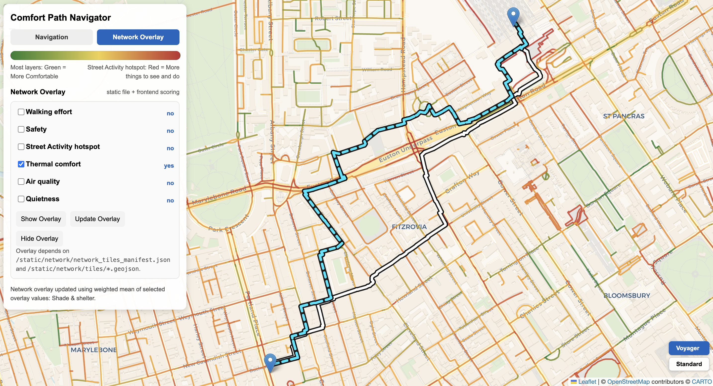
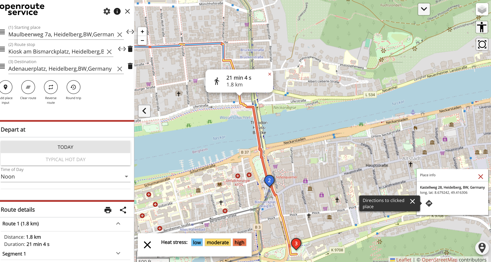
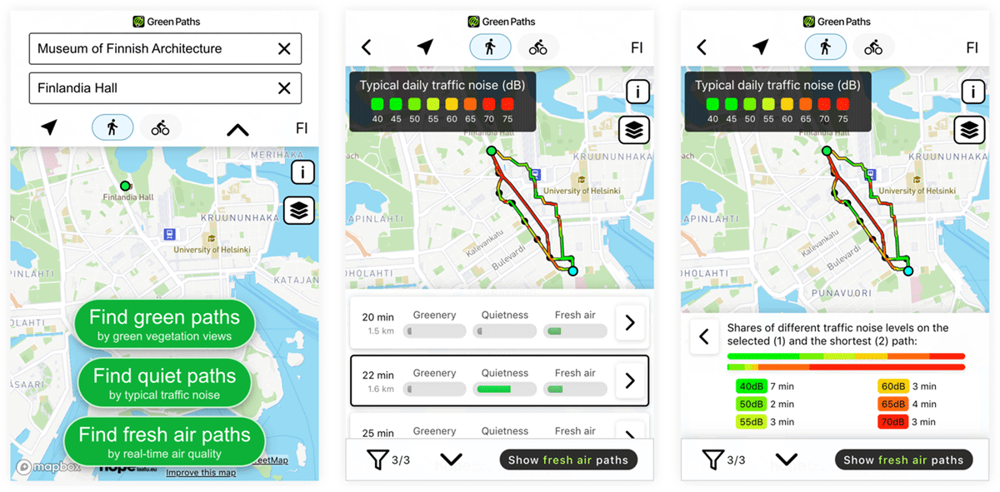
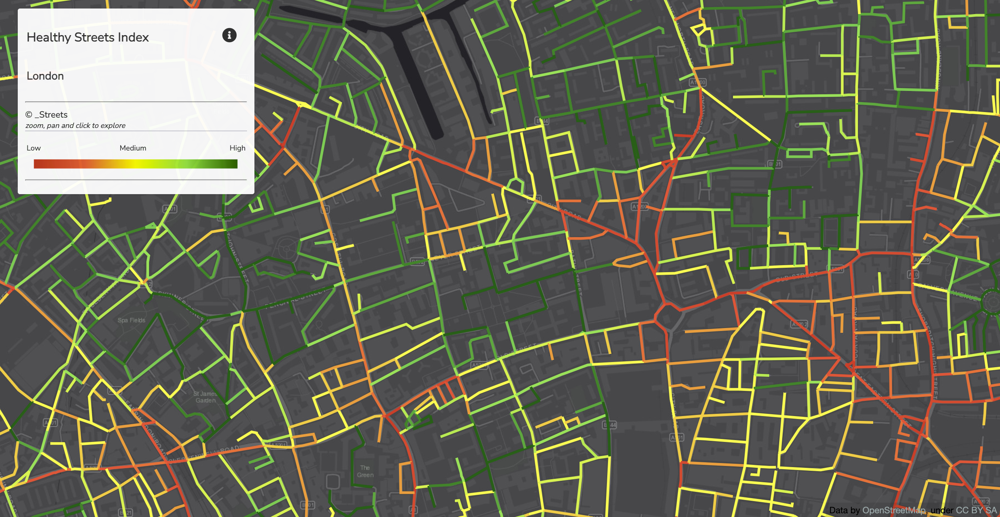
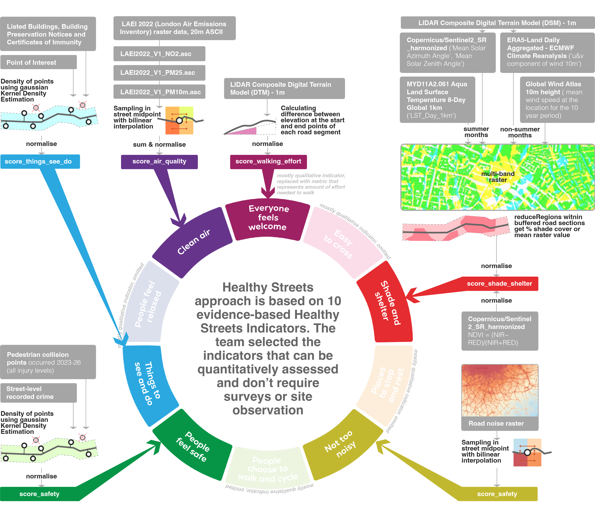
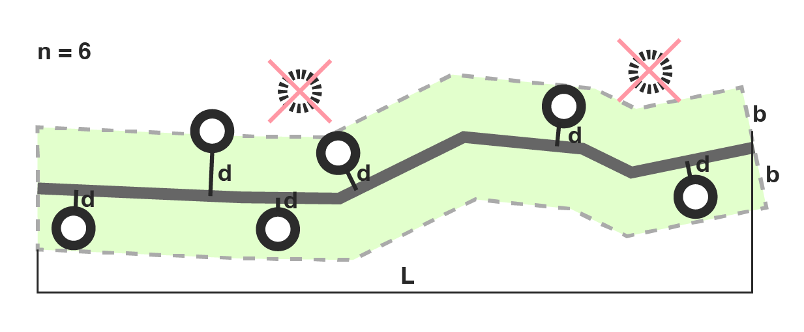
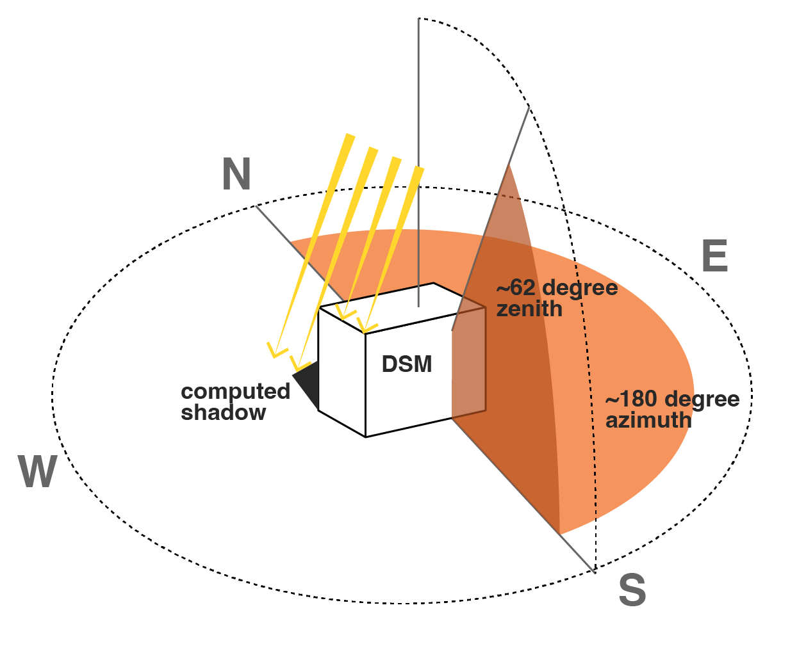
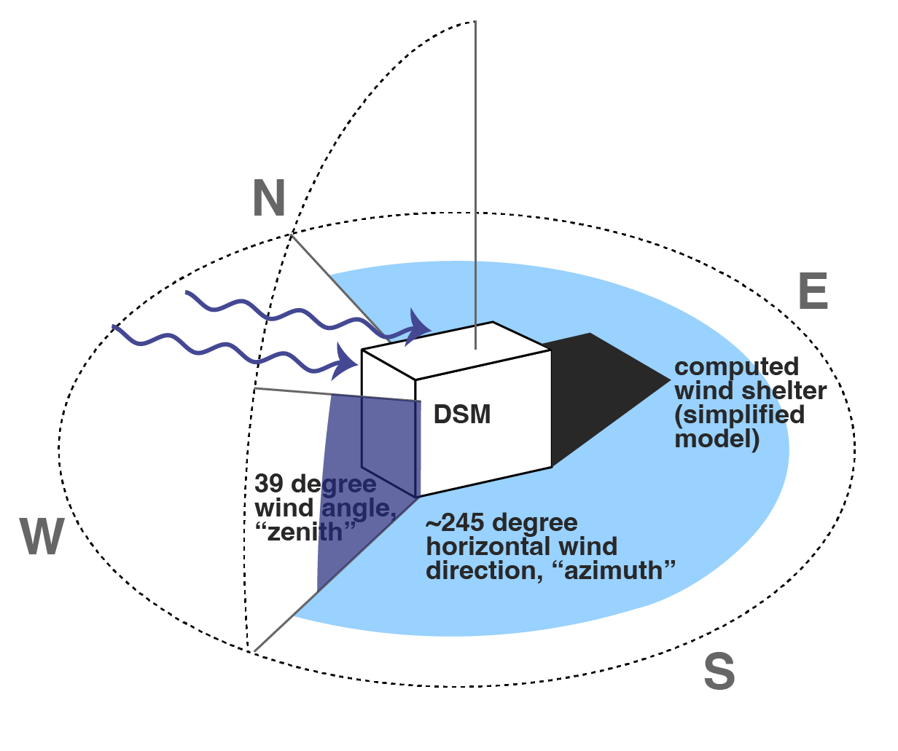

## The application

{width=100%}

Our project enables a wide range of users to analyse the walkability of London’s streets and 
explore specific routes.

---

## Problem Statement

:::: {.columns}

::: {.column width="33%"}
{width=100%}
:::

::: {.column width="33%"}
{width=100%}
:::

::: {.column width="33%"}
{width=100%}
:::

::::

**Why?** The apps on the market focus on a few selected indicators or are not interactive.

**Who are the users?** Policy-makers and the general public.

---

## Data and Methodology

{style="max-height:500px; width:100%; object-fit:contain;" fig-align="left" .lightbox}

---

We transformed the scores into penalties, and applied them on a network graph with the following routing cost formula:
$$
\begin{aligned}
\text{edge_cost} =\;&
w_{\text{length}} \cdot \text{length}_{\text{norm}} \\
&+ w_{\text{safety}} \cdot \text{unsafety}_{\text{penalty}} \\
&+ w_{\text{activity}} \cdot \text{inactivity}_{\text{penalty}} \\
&+ w_{\text{walk}} \cdot \text{walking_effort}_{\text{penalty}} \\
&+ w_{\text{shade}} \cdot \text{lack_shade_shelter}_{\text{penalty}} \\
&+ w_{\text{air}} \cdot \text{polluted_air}_{\text{penalty}} \\
&+ w_{\text{noise}} \cdot \text{road_noise}_{\text{penalty}}
\end{aligned}
$$


# Contributions

---

## Network Graph

Yu say here how did you approach building the network graph and why we chose OSM

---

## Indicators: Things to see & do, Safety

“Hot routes” originally developed (Tompson, Partridge and Shepherd, 2009) to better represent 
on-route concentrations.
$$
\text{KDE}_{\text{segment}}
=
\frac{
\sum_{i=1}^{n}
e^{-0.5 \times \left(d_i / b\right)^2}
}{
\text{L}
}
$$

{width=100% fig-align="center"}

---

## Indicators: Shade and shelter

:::: {.columns}

::: {.column width="50%"}
{width=100%}
:::

::: {.column width="50%"}
{width=100%}
:::

::::

GEE script using `ee.Terrain.hillShadow()` with England 1m DSM for sun and wind + mean wind speeds + mean surface temperature

---

Solar position and shadow map

``` python
times = pd.date_range(start="2025-04-19 06:00", end="2026-09-19 20:00", freq="1h", tz=timezone)
# Calculate solar position
solar = get_solarposition(time=times,latitude=lat,longitude=lon)
daytime = solar[solar["apparent_elevation"] > 0] # Keep only daytime observations

# Mean solar angles across the whole period
mean_azimuth = daytime["azimuth"].mean()
mean_zenith = daytime["apparent_zenith"].mean()
```

``` javascript
var shadowMap = ee.Terrain.hillShadow({
  image: londonDsmMerc,
  azimuth: 180.02504604372402,
  zenith: 62.63912040279354,
  neighborhoodSize: 100,
  hysteresis: false
});
// Generate the shadow map
var londonShadow = shadowMap.eq(0).rename('shadow')// 1 = shadow, 0 = not shadow
  .toFloat()
  .setDefaultProjection(targetProj);
```

---

Wind direction and wind pseudo-shadows
``` javascript
// WIND DIRECTION
var wind = windSource
  .filterBounds(london)
  .filterDate('2025-10-19', '2026-03-19')
  .select(['u_component_of_wind_10m', 'v_component_of_wind_10m'])
  .mean()
  .clipToCollection(london);

// direction wind blows TO
var windTo = wind.expression(
  '(atan2(u, v) * 180 / pi + 360) % 360', {
    u: wind.select('u_component_of_wind_10m'),
    v: wind.select('v_component_of_wind_10m'),
    pi: Math.PI
}).rename('wind_to');

// convert to direction wind comes FROM
var windFrom = windTo.add(180).mod(360).rename('wind_from');

var meanWindFrom = ee.Number(
  windFrom.reduceRegion({
    reducer: ee.Reducer.mean(),
    geometry: london,
    scale: 1000,
    bestEffort: true,
    maxPixels: 1e8
  }).get('wind_from')
);

// 0 = sheltered, 1 = exposed
var windShelterRaw = ee.Terrain.hillShadow({
  image: londonDsmMerc,
  azimuth: meanWindFrom,
  zenith: 39,
  neighborhoodSize: 9,
  hysteresis: false
});

// 1 = wind protected, 0 = not protected
var windProtected = windShelterRaw.eq(0)
  .rename('wind_protected')
  .toFloat()
  .setDefaultProjection(targetProj);
```
---

`ee.Reducer.mean()` over multi-band raster

<iframe src='https://ee-panevauk1.projects.earthengine.app/view/sunwindshelter' width='100%' height='200px'></iframe>

``` javascript
function computeBatchStats(roadsBatch) {
  var bufferedBatch = bufferRoads(roadsBatch);

  return stacked.reduceRegions({
    collection: bufferedBatch,
    reducer: ee.Reducer.mean(),
    scale: 1,
    crs: 'EPSG:3857',
    tileScale: 8
  });
}
```

---

NDVI

Yuqian

The NDVI was [computed](https://github.com/iiishop/CASA0025_Project/blob/main/ComfortPath/backend/app/ndvi_service.py) with Sentinel2 using the classic approach, and then aggregated into the combined score.

---

## Indicators: Clean air & noise

The indicators were normalised and treated for missing and extreme values. The normalized indicators were then integrated via a weighted linear combination to derive a composite index for each road segment. Script [here](https://github.com/iiishop/CASA0025_Project/blob/main/ComfortPath/backend/app/laei_service.py).

---

## Indicators: Walking effort

Slope was derived from a DEM by sampling the start and end points of each road segment and calculating the 
elevation difference relative to the segment length. This allowed each segment to be described not only 
by distance but also by the physical effort required to walk along it. The script for this part can be found [here](https://github.com/iiishop/CASA0025_Project/blob/main/ComfortPath/yu_routing/data-prep/add_slope_to_network.py).

---

## Building the application

---

## Website appearance

{width=100%}

---

## Thank you!

CASA0025 Group 1

Authors: Yu Shi, Anna Saveleva, Yuqian Lin
