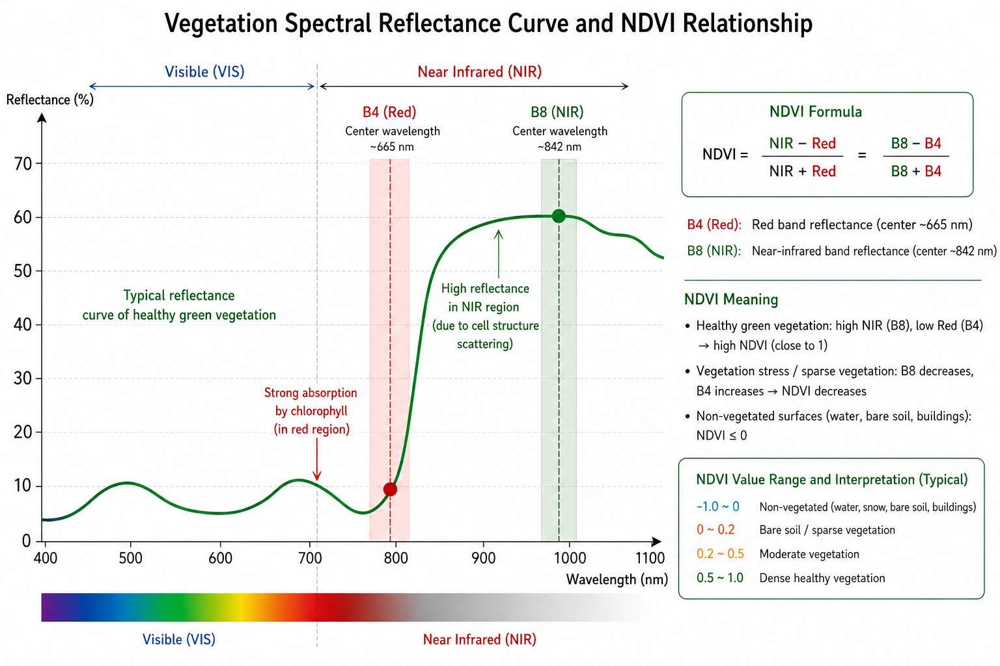
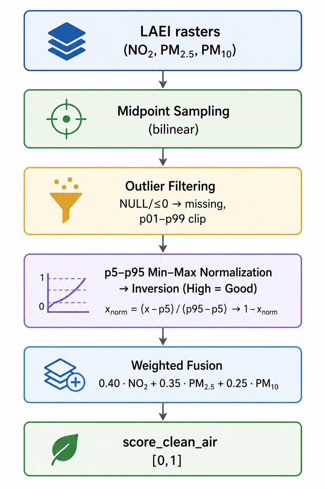

## The application

{width=100%}

Our project enables a wide range of users to analyse the walkability of London’s streets and 
explore specific routes.

---

## Problem Statement

:::: {.columns}

::: {.column width="33%"}
{width=100%}
:::

::: {.column width="33%"}
{width=100%}
:::

::: {.column width="33%"}
{width=100%}
:::

::::

**Why?** The apps on the market focus on a few selected indicators or are not interactive.

---

## Data and Methodology

{style="max-height:500px; width:100%; object-fit:contain;" fig-align="left" .lightbox}

---

We transformed the scores into penalties, and applied them on a network graph with the following routing cost formula:

$$
\begin{aligned}
\mathrm{edge\_cost} ={}& w_{\mathrm{length}} \cdot \mathrm{length\_norm} \\
&+ w_{\mathrm{safety}} \cdot \mathrm{unsafety\_penalty} \\
&+ w_{\mathrm{activity}} \cdot \mathrm{inactivity\_penalty} \\
&+ w_{\mathrm{walk}} \cdot \mathrm{walking\_effort\_penalty} \\
&+ w_{\mathrm{shade}} \cdot \mathrm{lack\_shade\_shelter\_penalty} \\
&+ w_{\mathrm{air}} \cdot \mathrm{polluted\_air\_penalty} \\
&+ w_{\mathrm{noise}} \cdot \mathrm{road\_noise\_penalty}
\end{aligned}
$$

---

# Contributions

---

## Network Graph

Yu say here how did you approach building the network graph and why we chose OSM

---

## Indicators: Things to see & do, Safety

“Hot routes” originally developed (Tompson, Partridge and Shepherd, 2009) to better represent 
on-route concentrations.
$$
\text{KDE}_{\text{segment}}
=
\frac{
\sum_{i=1}^{n}
e^{-0.5 \times \left(d_i / b\right)^2}
}{
\text{L}
}
$$

{width=100% fig-align="center"}

---

## Indicators: Shade and shelter

:::: {.columns}

::: {.column width="50%"}
{width=100%}
:::

::: {.column width="50%"}
{width=100%}
:::

::::

GEE script using `ee.Terrain.hillShadow()` with England 1m DSM for sun and wind + mean wind speeds + mean surface temperature

---

Solar position and shadow map

``` python
times = pd.date_range(start="2025-04-19 06:00", freq="1h", tz=timezone)
# Calculate solar position
solar = get_solarposition(time=times,latitude=lat,longitude=lon)
daytime = solar[solar["apparent_elevation"] > 0] # Keep only daytime observations

# Mean solar angles across the whole period
mean_azimuth = daytime["azimuth"].mean()
mean_zenith = daytime["apparent_zenith"].mean()
```

``` javascript
var shadowMap = ee.Terrain.hillShadow({
  image: londonDsmMerc,
  azimuth: 180.02504604372402,
  zenith: 62.63912040279354,
  neighborhoodSize: 100,
  hysteresis: false
});
// Generate the shadow map
var londonShadow = shadowMap.eq(0).rename('shadow')// 1 = shadow, 0 = not shadow
  .toFloat()
  .setDefaultProjection(targetProj);
```

---

Wind direction and wind pseudo-shadows
``` javascript
// WIND DIRECTION
var wind = windSource
  .filterBounds(london)
  .filterDate('2025-10-19', '2026-03-19')
  .select(['u_component_of_wind_10m', 'v_component_of_wind_10m'])
  .mean()
  .clipToCollection(london);

// direction wind blows TO
var windTo = wind.expression(
  '(atan2(u, v) * 180 / pi + 360) % 360', {
    u: wind.select('u_component_of_wind_10m'),
    v: wind.select('v_component_of_wind_10m'),
    pi: Math.PI
}).rename('wind_to');

// convert to direction wind comes FROM
var windFrom = windTo.add(180).mod(360).rename('wind_from');

var meanWindFrom = ee.Number(
  windFrom.reduceRegion({
    reducer: ee.Reducer.mean(),
    geometry: london,
    scale: 1000,
    bestEffort: true,
    maxPixels: 1e8
  }).get('wind_from')
);

// 0 = sheltered, 1 = exposed
var windShelterRaw = ee.Terrain.hillShadow({
  image: londonDsmMerc,
  azimuth: meanWindFrom,
  zenith: 39,
  neighborhoodSize: 9,
  hysteresis: false
});

// 1 = wind protected, 0 = not protected
var windProtected = windShelterRaw.eq(0)
  .rename('wind_protected')
  .toFloat()
  .setDefaultProjection(targetProj);
```
---

`ee.Reducer.mean()` over multi-band raster

<iframe src='https://ee-panevauk1.projects.earthengine.app/view/sunwindshelter' width='100%' height='200px'></iframe>

``` javascript
function computeBatchStats(roadsBatch) {
  var bufferedBatch = bufferRoads(roadsBatch);

  return stacked.reduceRegions({
    collection: bufferedBatch,
    reducer: ee.Reducer.mean(),
    scale: 1,
    crs: 'EPSG:3857',
    tileScale: 8
  });
}
```

---

## Indicators: NDVI (Green space exposure)

::: {.columns}

::: {.column width="45%"}
NDVI was derived from Sentinel-2 (2023, cloud < 35%) using the classic approach. Values are 
sampled at each road segment's midpoint, mapped from [-1, 1] to [0, 1], then fused with shade 
& shelter at equal weight and re-normalised (p5-p95) into score_shade_shelter_final.

$$
\text{NDVI} = \frac{\text{NIR} - \text{Red}}{\text{NIR} + \text{Red}} = \frac{B8 - B4}{B8 + B4}
$$
:::

::: {.column width="55%"}
{width=100%}
:::

::::

---

### GEE acquisition

``` python
s2 = ee.ImageCollection("COPERNICUS/S2_SR_HARMONIZED") \
    .filterBounds(london) \
    .filterDate("2023-01-01", "2023-12-31") \
    .filter(ee.Filter.lt("CLOUDY_PIXEL_PERCENTAGE", 35))

ndvi = s2.median() \
    .normalizedDifference(["B8", "B4"]) \
    .focal_mean(radius=40, units="meters") \
    .clamp(-1, 1)
```

---

### Fusion with shade & shelter

``` python
# NDVI mapped from [-1,1] to [0,1]
score_green_ndvi = (ndvi + 1.0) / 2.0

# Merge 50/50 with shade, then p5-p95 normalisation
score_shade_ndvi_raw = 0.5 * shade_score + 0.5 * score_green_ndvi

p5, p95 = np.percentile(score_shade_ndvi_raw, [5, 95])
score_shade_shelter_final = np.clip(
    (score_shade_ndvi_raw - p5) / (p95 - p5), 0.0, 1.0
)
```

Scripts: [download_ndvi_from_gee.py](https://github.com/iiishop/CASA0025_Project/blob/main/ComfortPath/backend/scripts/download_ndvi_from_gee.py) · [ndvi_service.py](https://github.com/iiishop/CASA0025_Project/blob/main/ComfortPath/backend/app/ndvi_service.py)

---

## Indicators: Clean air

::: {.columns}

::: {.column width="40%"}
NO₂, PM₂.₅, and PM₁₀ were sampled at each road segment's midpoint from LAEI rasters. 
NULL and ≤0 values treated as missing, then each pollutant normalised (p5-p95) and reversed.

$$
\begin{array}{l}
\text{air} =\; 0.40 \cdot \text{NO}_2 \\
+\; 0.35 \cdot \text{PM}_{2.5} \\
+\; 0.25 \cdot \text{PM}_{10}
\end{array}
$$
:::

::: {.column width="60%"}
{width=40%}
:::

::::

[Script](https://github.com/iiishop/CASA0025_Project/blob/main/ComfortPath/backend/app/laei_service.py).

---

### Outlier handling & normalisation

``` python
# Per-pollutant: NULL / <=0 / <= -9990 → missing
valid = np.isfinite(val) and val != nodata and val > -9990

# p5-p95 robust min-max to [0,1]
p5, p95 = np.percentile(values, [5, 95])
score = np.clip((arr - p5) / (p95 - p5), 0.0, 1.0)
```

### Weighted fusion

``` python
# Default weights
weights = AirQualityWeights(no2=0.40, pm25=0.35, pm10=0.25)

no2_n  = self._normalize("no2", no2)
pm25_n = self._normalize("pm25", pm25)
pm10_n = self._normalize("pm10", pm10)

aq_score = (no2_n * weights.no2 + pm25_n * weights.pm25 +
            pm10_n * weights.pm10) / (weights.no2 + weights.pm25 + weights.pm10)
```

---

## Indicators: Noise

Road traffic noise (Lden/Lday) was sampled at each road segment's midpoint from DEFRA 
noise rasters. Outlier handling follows the same procedure as air quality: NULL and ≤0 values 
are treated as missing, filled via median imputation, and clipped at p1–p99.

Unlike air quality, noise uses a **fixed physical range** for normalisation:

$$
\text{score\_not\_too\_noisy} = 1 - \frac{\text{dB} - 40}{85 - 40}
$$

Each road segment is scored on the [40, 85] dB interval, then reversed so higher scores 
indicate quieter streets. The routing engine uses score_not_too_noisy directly.
[Script](https://github.com/iiishop/CASA0025_Project/blob/main/ComfortPath/backend/app/laei_service.py).

---

## Indicators: Walking effort

Slope was derived from a DEM by sampling the start and end points of each road segment and calculating the 
elevation difference relative to the segment length. This allowed each segment to be described not only 
by distance but also by the physical effort required to walk along it. The script for this part can be found [here](https://github.com/iiishop/CASA0025_Project/blob/main/ComfortPath/yu_routing/data-prep/add_slope_to_network.py).

---

## Building the application

---

## Website appearance

{width=100%}

---

## Thank you!

CASA0025 Group 1

Authors: Yu Shi, Anna Saveleva, Yuqian Lin
